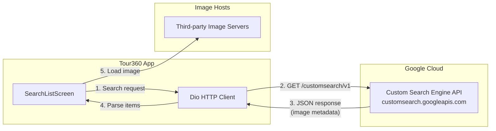
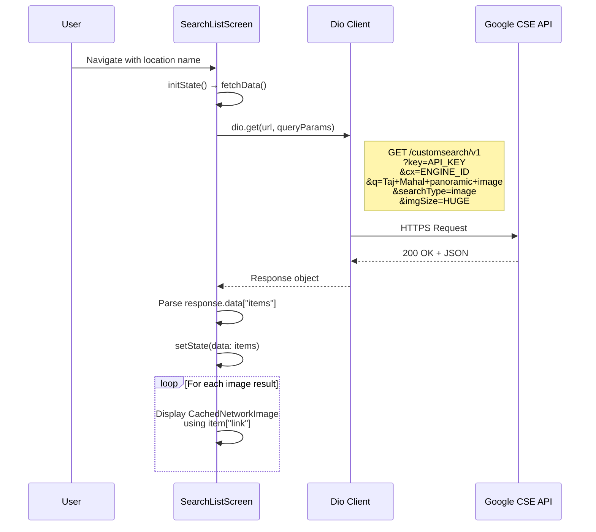
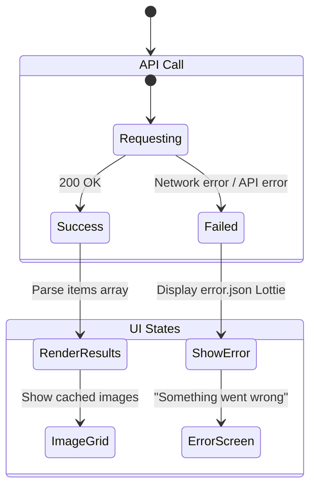
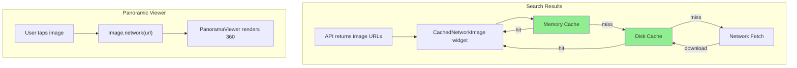
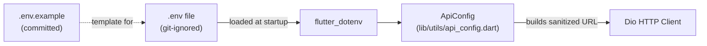

# API Integration

This document describes how Tour360 integrates with external APIs for fetching panoramic imagery.

## Overview



## Google Custom Search API

### Endpoint

```
GET https://customsearch.googleapis.com/customsearch/v1
```

### Request Parameters

| Parameter | Value | Description |
|-----------|-------|-------------|
| `key` | API Key | Google Cloud API key |
| `cx` | Search Engine ID | Custom Search Engine identifier |
| `q` | `"{location} panoramic image"` | Search query with location name |
| `searchType` | `image` | Restrict results to images only |
| `imgSize` | `HUGE` | Request high-resolution images suitable for panoramic viewing |

### Request Flow



### Response Structure

```json
{
  "items": [
    {
      "title": "Panoramic view of Taj Mahal",
      "link": "https://example.com/tajmahal-panorama.jpg",
      "image": {
        "contextLink": "https://example.com/page",
        "thumbnailLink": "https://example.com/tajmahal-thumb.jpg",
        "width": 4000,
        "height": 2000
      }
    }
  ]
}
```

### Fields Used by the App

| Field | Usage |
|-------|-------|
| `items[].link` | Full-resolution image URL displayed in search results and loaded into PanoramaViewer |
| `items[].title` | (Available but currently unused) |

## Error Handling



| State | UI | Trigger |
|-------|-----|---------|
| **Loading** | Lottie `loading2.json` animation | `fetchData()` called, `isLoading = true` |
| **Success** | Scrollable image grid | API returns valid items, `isLoading = false` |
| **Error** | Lottie `error.json` + error message | API call throws exception, `isError = true` |

## Rate Limits & Quotas

The Google Custom Search JSON API has the following limits:

| Tier | Queries/Day | Cost |
|------|------------|------|
| Free | 100 | Free |
| Paid | 10,000+ | $5 per 1,000 queries |

## Image Loading Pipeline



## Security

API keys are managed via environment variables using `flutter_dotenv`. The `.env` file is git-ignored.



### Setup

```bash
cp .env.example .env
# Then edit .env with your actual keys
```

### How it works

| Layer | File | Responsibility |
|-------|------|---------------|
| Storage | `.env` | Stores `GOOGLE_API_KEY` and `GOOGLE_CX` (git-ignored) |
| Template | `.env.example` | Committed template for other developers |
| Loading | `main.dart` | Calls `dotenv.load()` at app startup |
| Access | `lib/utils/api_config.dart` | Reads env vars, builds URLs, sanitizes input |

### Security measures

| Concern | Status |
|---------|--------|
| API Key exposure | Stored in `.env`, git-ignored, loaded via `flutter_dotenv` |
| Search Engine ID | Stored in `.env`, git-ignored, loaded via `flutter_dotenv` |
| HTTPS | All API calls use HTTPS |
| Input sanitization | `ApiConfig._sanitizeQuery()` strips special characters before API calls |
| URL encoding | Query params encoded via `Uri.encodeComponent()` |
