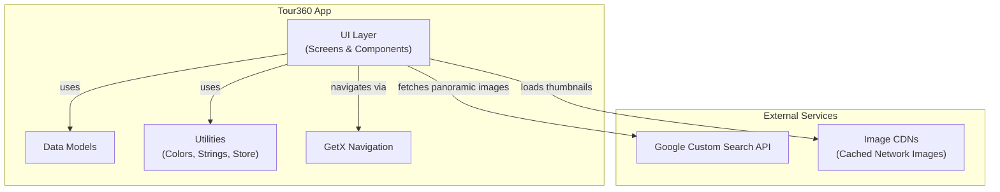
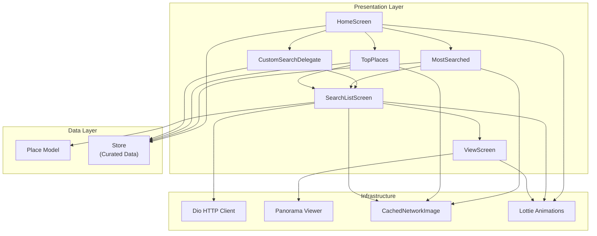
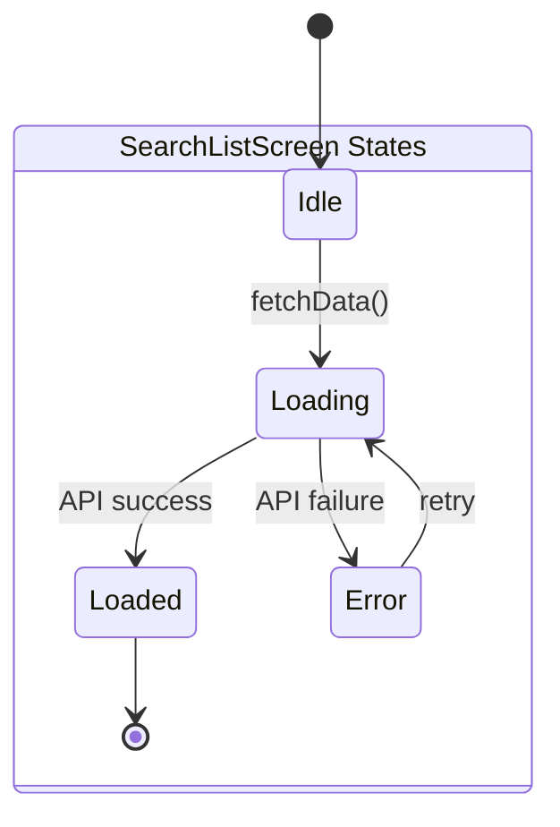
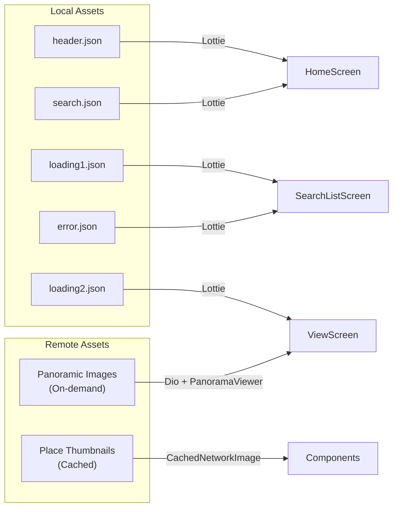

# Architecture Overview

This document describes the high-level architecture of the Tour360 Flutter application.

## System Architecture

## Layered Architecture

The app uses a simple, pragmatic layered architecture optimized for a focused feature set.

## Component Responsibilities

### Screens

| Screen | Responsibility |
|--------|---------------|
| **HomeScreen** | Entry point. Displays animated header, search button, curated carousels (MostSearched, TopPlaces). |
| **SearchListScreen** | Fetches and displays panoramic image results from Google Custom Search API for a given location. |
| **ViewScreen** | Renders an interactive 360-degree panoramic view of a selected image. |

### Components

| Component | Responsibility |
|-----------|---------------|
| **CustomSearchDelegate** | Provides search UI with autocomplete from 400+ pre-populated suggestions. |
| **MostSearched** | Horizontal scrollable carousel of 8 curated popular destinations. |
| **TopPlaces** | Vertical card list of 16 curated top tourist destinations. |

### Models

| Model | Fields | Purpose |
|-------|--------|---------|
| **Place** | `name`, `image` | Represents a tourist destination with a display name and thumbnail URL. |

### Utilities

| Utility | Purpose |
|---------|---------|
| **palatte.dart** | Centralized color constants (background, primary green, white). |
| **store.dart** | Curated data: most-searched places, top places, and 408 search suggestion strings. |
| **strings.dart** | UI string constants for labels and messages. |

## State Management

The app uses **local StatefulWidget state** for screen-level data and **GetX** exclusively for navigation.

Each screen manages its own state variables (`isLoading`, `isError`, `data`) directly within `setState()`. There are no global state controllers, streams, or reactive bindings beyond navigation.

### Why This Approach

- The app has a small, focused feature set (browse, search, view)
- No shared state is needed across screens (data flows forward via constructor parameters)
- Simplicity reduces boilerplate and cognitive overhead for a team of this size

## Design Patterns

| Pattern | Usage |
|---------|-------|
| **Composition** | Screens composed from reusable components (MostSearched, TopPlaces) |
| **Delegate** | Flutter's SearchDelegate pattern for search UX |
| **Constructor Injection** | Screen data passed via widget constructors through GetX navigation |
| **Constants Extraction** | Colors, strings, and curated data centralized in `utils/` |

## Assets Strategy

- **Lottie animations** are bundled locally in `assets/` for instant loading
- **Place thumbnails** are fetched from CDNs and cached via `cached_network_image`
- **Panoramic images** are fetched on-demand from Google Custom Search API results
