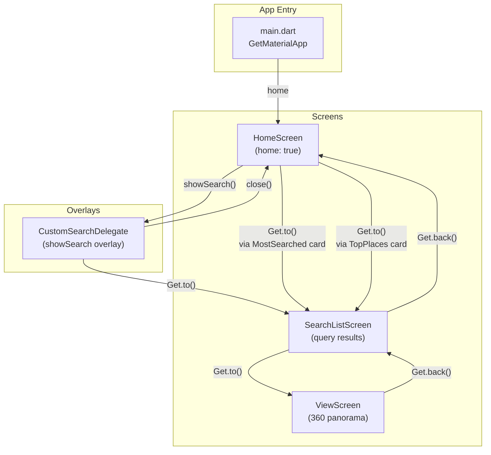
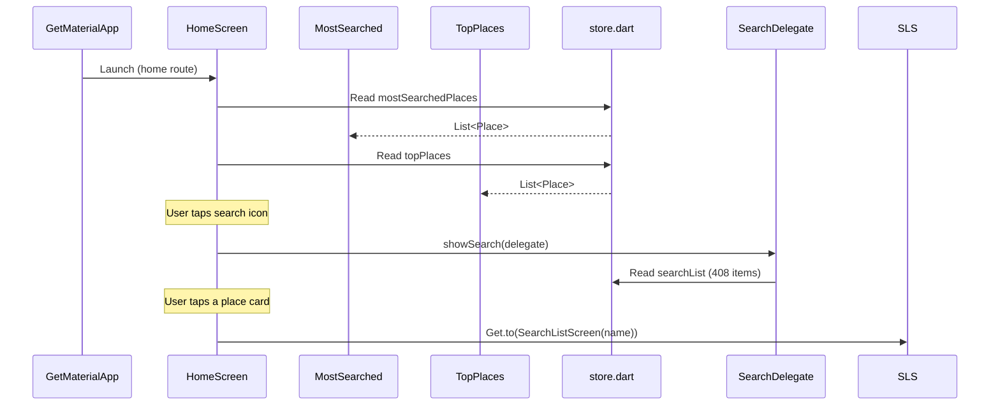
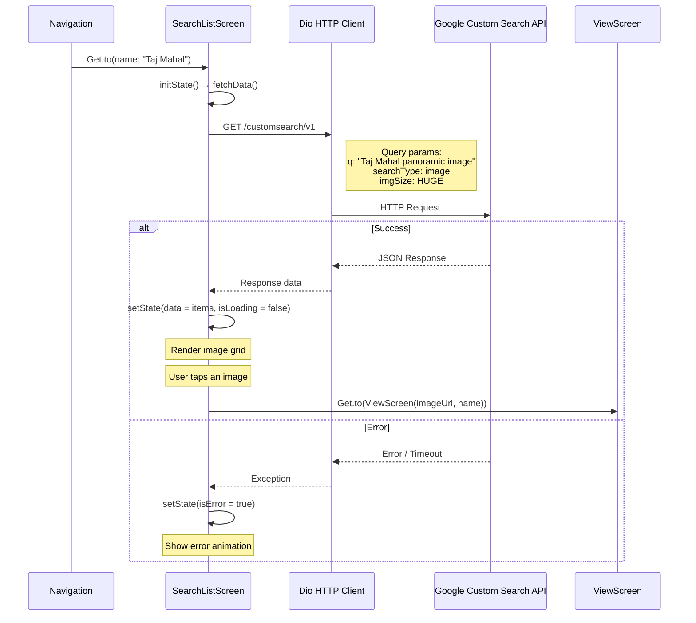
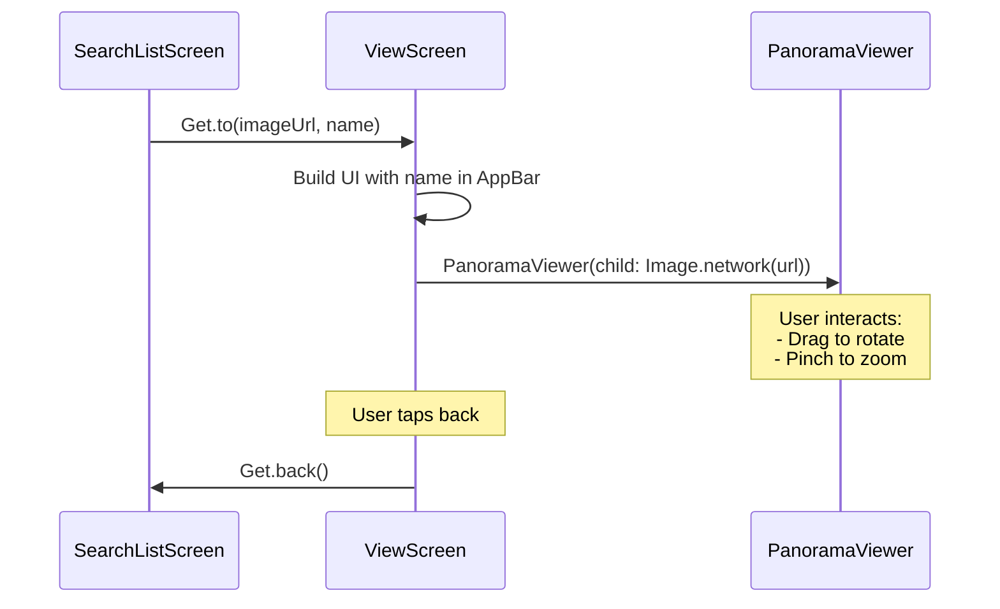
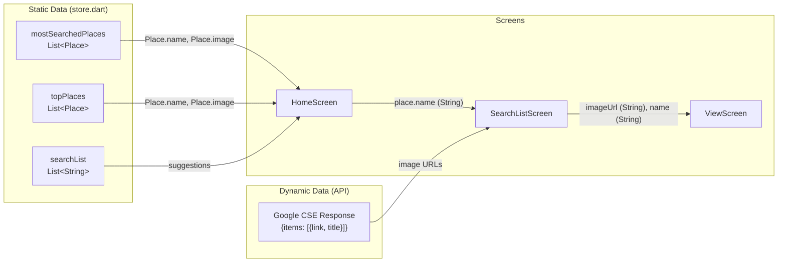
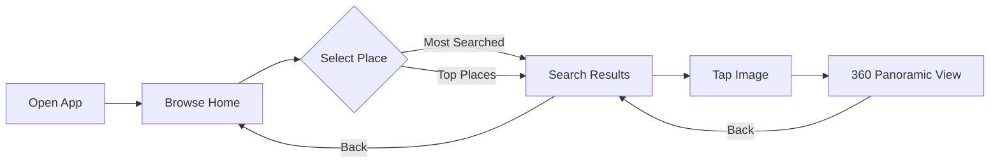
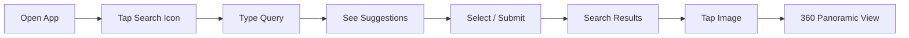

# Navigation & Data Flow

This document describes the screen navigation graph and how data flows through the Tour360 application.

## Navigation Graph

## Data Flow Per Screen

### HomeScreen

### SearchListScreen

### ViewScreen

## Data Model Flow

## Navigation Parameters

| Route | Parameters | Type | Description |
|-------|-----------|------|-------------|
| HomeScreen | - | - | No parameters (entry point) |
| SearchListScreen | `name` | `String` | Location name to search for panoramic images |
| ViewScreen | `imageUrl` | `String` | URL of the panoramic image to display |
| ViewScreen | `name` | `String` | Location name for the app bar title |

## User Journey Flows

### Browse and View Flow

### Search Flow

